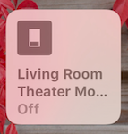
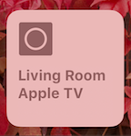

# homebridge-theater-mode

> A [homebridge](https://github.com/nfarina/homebridge) plugin to make your HomeKit devices react to the play/pause state of your Apple TV. Configured via the Home app.

[](https://badge.fury.io/js/homebridge-theater-mode)
[![License][license-image]][license-url]

## Overview

`homebridge-theater-mode` started as a pet project of mine. I loved using Plex's webhooks to control my Hue bulbs, but I wanted that to extend to other apps on my Apple TV.

To enable this project, I created [node-appletv](https://github.com/edc1591/node-appletv) to communicate with the Apple TV. This uses a new protocol introduced by Apple with the 4th-generation Apple TV and there still isn't much out there about it. I did my best to reverse engineer the iOS Apple TV app to determine how it tracks the play/pause state, depsite the quirks I ran into with the new protocol.

Because of this, at times the plugin can be slightly slow to receive state changes, but it always does seem to settle out after a few seconds. It works well enough for me, so I hope it does for you, too!

## Installation

Follow the steps below to pair your Apple TV after installation is complete.

```bash
# Install homebridge
$ npm install -g homebridge

# Install plugin
$ npm install -g homebridge-theater-mode
```

or add `homebridge-theater-mode` to your `install.sh` file.

## Pairing

The pairing process makes use of the command line utility that ships with `node-appletv`. You must be on the same network as your Apple TV to pair.

```bash
# Install node-appletv
$ npm install -g node-appletv

# Scan for Apple TVs and follow the prompts
$ appletv pair
```

At the end of the process, you'll received a credentials string. This string should be input into the `credentials` field in your `config.json` entry for the Apple TV. See the example below or [config.example.json](config.example.json) for a practical use.

```json
{
  "accessory": "AppleTVTheaterMode",
  "name": "Living Room Apple TV",
  "credentials": "<credentials>"
}
```

## Usage

Two devices are added to your Home app by `homebridge-theater-mode` for each paired Apple TV.

The **Theater Mode Switch** is used to toggle theater mode on and off. It is recommend that you turn this off when you are done watching. This will prevent your lights from going crazy when you start AirPlaying music later. Each Apple TV gets its own Theater Mode switch.

The **Apple TV Programmable Light Switch** is used to define what should happen when theater mode is enabled and your Apple TV enters one of three states (playing, paused, and stopped). This programmable switch has three "buttons," one for each state. 3D touch on the programmable switch and tap details. You'll then be able to configure each of these three buttons. See below for which button is which.

<br>

|               |       Apple TV State      |
| :-----------: | :-----------------------: |
| Button 1      | Play                      |
| Button 2      | Plause                    |
| Button 3      | Stop (Tapping "Menu")     |

## Meta

You can find me on Twitter [@edc1591](https://twitter.com/edc1591)

Distributed under the MIT license. See ``LICENSE`` for more information.

[license-image]: https://img.shields.io/badge/License-MIT-blue.svg
[license-url]: LICENSE